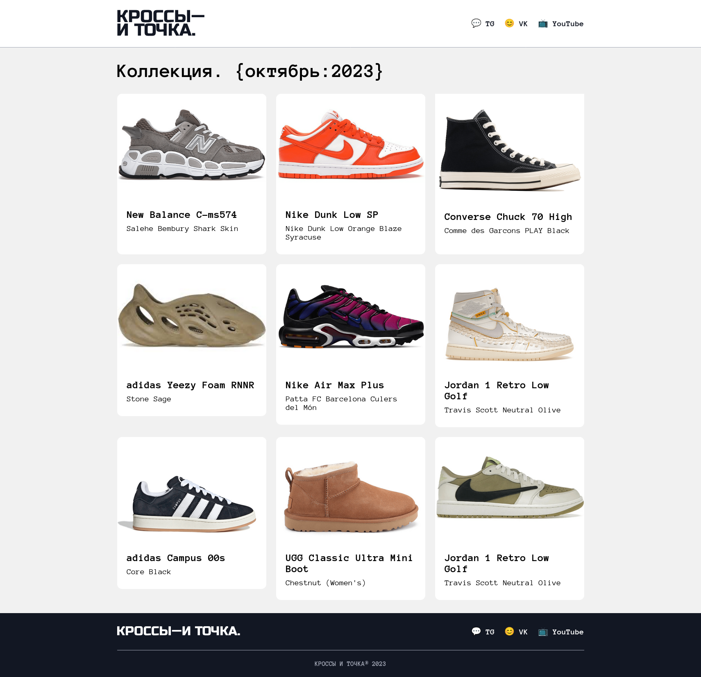
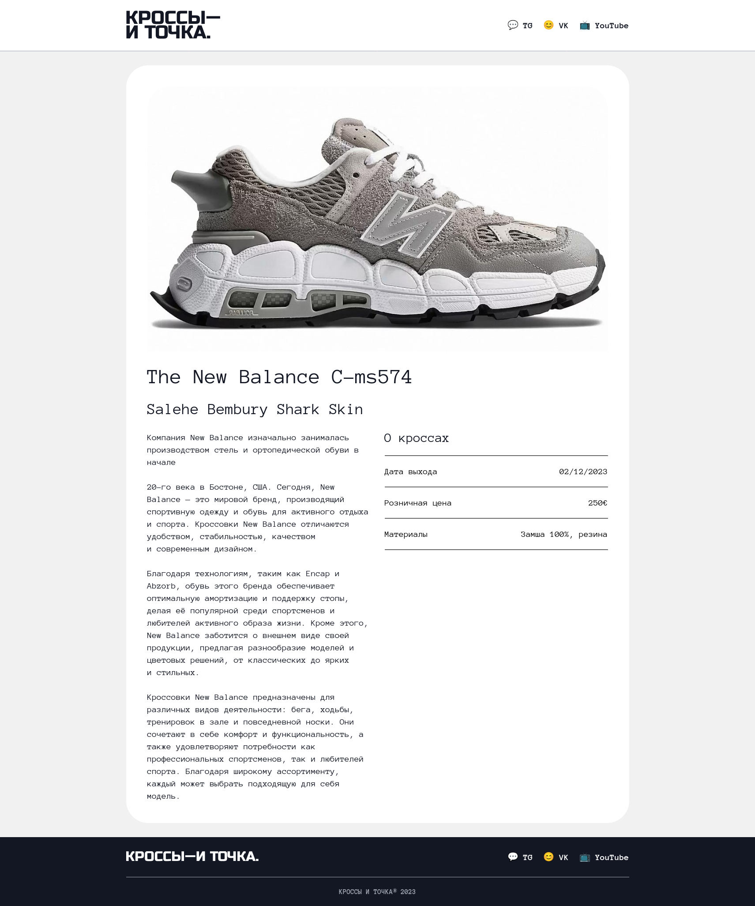

# Krosses and Dot Web Project

**First web project from Yandex Practicum, written in 2023.**  
**Первый веб-проект с Яндекс Практикума, написан в 2023 году.**

<table width="100%">
  <tr>
    <td width="50%" align="center">
      
    </td>
    <td width="50%" align="center">
      
    </td>
  </tr>
</table>

---

## Description / Описание

**English:**  
My very first web project created during Yandex Practicum courses. A simple practice project focusing on HTML and CSS basics.

**Русский:**  
Мой самый первый веб-проект, созданный на курсах Яндекс Практикума. Простой практический проект, посвящённый основам HTML и CSS.

---

## Technologies / Технологии

* HTML
* CSS

---

## How to view / Как посмотреть

- Clone the repository:  
```bash
git clone https://github.com/yarchefis/krosses-and-dot-web-project.git
```
 - Open the `index.html` file in any browser.

Or view online:
[https://yarchefis.github.io/krosses-and-dot-web-project/](https://yarchefis.github.io/krosses-and-dot-web-project/)

take a look at my website. There are even more interesting projects there
загляните ко мне на сайт. Там еще больше интересных проектов
yardev.pw
